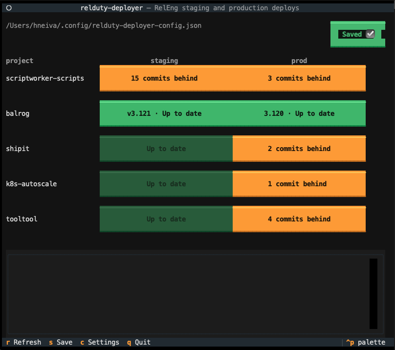
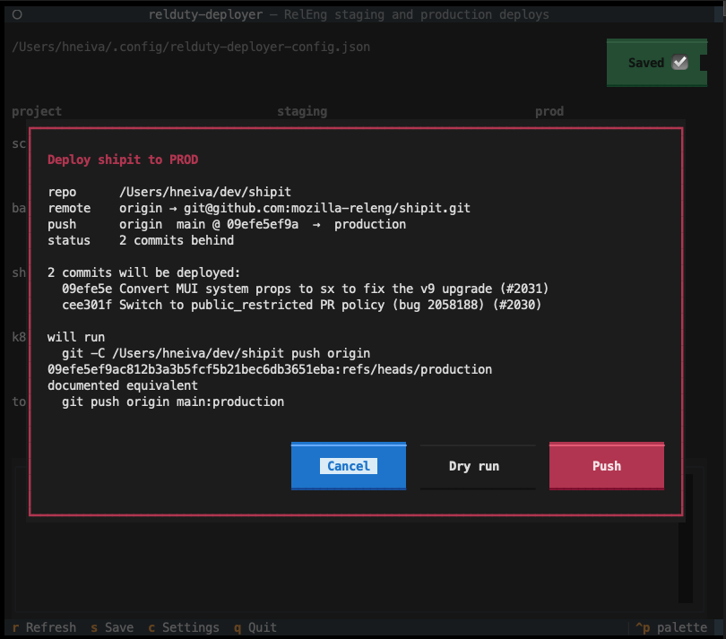
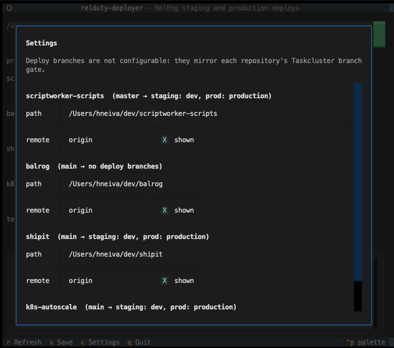

# relduty-deployer

A terminal dashboard for the Mozilla Release Engineering deploy rotation. It fetches every
RelEng project it knows about, shows how far each environment is behind, and performs the
fast-forward push that deploys it.

RelEng stages deployments every Tuesday and pushes them to production every Thursday. Doing
that by hand means remembering that five repositories have three different source branches
and two different names for "staging", and fetching each one before you can tell whether
there is anything to deploy at all.

For example:

```
 project                 staging                             prod
 scriptworker-scripts    15 commits behind                   3 commits behind
 balrog                  v3.121 unreleased · 2 behind        3.120 · Up to date
 shipit                  2 commits behind                    2 commits behind
 k8s-autoscale           1 commit behind                     1 commit behind
 tooltool                4 commits behind                    4 commits behind
```

## Install and run

```bash
uv sync
uv run relduty-deployer            # the dashboard
uv run relduty-deployer status     # the same numbers, printed and somewhat scriptable
uv run relduty-deployer status --no-fetch
```

Keys: `r` refresh, `s` save settings, `c` settings, `q` quit.

## Deploy matrix

Every branch below was confirmed against the repository's `.taskcluster.yml` branch gate,
its README, and the GitHub API. These are facts about the repositories, so they live in
`projects.py` rather than in the config file — a wrong value here would push to a branch
nothing watches, which looks like success and deploys nothing.

| project | source | staging | production | strategy |
|---|---|---|---|---|
| scriptworker-scripts | `master` | `dev` | `production` | branch push |
| shipit | `main` | `dev` | `production` | branch push |
| k8s-autoscale | `main` | `dev` | `production` | branch push |
| tooltool | `master` | **`staging`** | `production` | branch push |
| balrog | `main` | GitHub release | ArgoCD | balrog (status only) |

Only the plain `dev` and `production` branches are offered for scriptworker-scripts. Its
per-script `dev-<script>` and `production-<script>` branches remain a manual escape hatch.

## What the colours mean

| button | meaning | pressing it |
|---|---|---|
| green `Up to date` | the environment matches its source branch | nothing |
| yellow `N commits behind` | a fast-forward would deploy N commits | opens the confirmation |
| red `N behind, M ahead` | the deploy branch has commits the source branch lacks | nothing |
| red `M ahead` | same, with nothing to deploy | nothing |
| grey `n/a` | the state could not be determined | nothing |

## Safety

The tool only ever fast-forwards, and `--force` is never passed on any code path. If a
deploy branch has commits its source branch does not, the button turns red and cannot be
pressed — that divergence has to be resolved by hand.

Four independent things have to agree before a push happens: classification marks only a
pure fast-forward as pushable, the button is disabled otherwise, the status is re-checked
immediately before pushing in case the branch diverged while the dialog was open, and the
push is not forced so git itself rejects a non-fast-forward.

The confirmation dialog shows the resolved commit sha, the commits being shipped, the
remote's URL, and the exact command. It offers a repeatable dry run, and Cancel holds the
initial focus so a stray Enter cannot deploy production.

Two further traps are checked rather than assumed. The remote must point at the canonical
`mozilla-releng` repository, because a push to a personal fork succeeds and deploys
nothing. And the push sends a resolved sha rather than a branch name, so what ships is
exactly what the status was measured from rather than whatever a local branch points at.

### Rolling back

Deliberately out of scope: a rollback is a force-push of an older revision, which is the
exact shape this tool refuses. Do it by hand, per
[the rollback runbook](https://github.com/mozilla-releng/scriptworker-scripts/blob/master/docs/scriptworkers-rollback.md):

```bash
git -C ~/dev/<project> push --force origin <known-good-sha>:refs/heads/production
```

## Balrog

Balrog has no deploy branches. It ships when a GitHub release tagged `v<version>` is
published — the release is what triggers the image build — and it reaches production only
when someone syncs and promotes the rollout in ArgoCD. Neither is automated here, so both
buttons open [the runbook](https://mozilla-balrog.readthedocs.io/en/latest/infrastructure.html#deploying-changes).

Status still comes from real sources. Staging is green when the version declared in
`pyproject.toml` on `main` has a published release. Production is green when it runs the
same version as stage, read from the public Dockerflow endpoints
(`aus-api.mozilla.org/__version__` and `stage.balrog.nonprod.webservices.mozgcp.net/__version__`).

Staging showing yellow is usually correct rather than a bug: the documented flow bumps the
version immediately after each release, so the steady state genuinely is "the version on
`main` has not been released yet".

## Configuration

`~/.config/relduty-deployer-config.json` holds only what differs between machines — the
checkout path, which remote deploys, and whether to show the project. It is created on
first run with paths under `~/dev`.

```json
{
  "schema_version": 1,
  "fetch_timeout_seconds": 60,
  "confirm_before_push": true,
  "projects": {
    "tooltool": { "path": "~/dev/tooltool", "remote": "origin", "enabled": true }
  }
}
```

The Save button is green `Saved ☑️` when memory matches disk and red `Save` when it does
not. Reverting an edit correctly returns it to green, because dirtiness is a comparison
against the file rather than a flag.

## Development

```bash
uv run pytest
uv run ruff check . && uv run ruff format --check .
uv run tox -e py314,check
pre-commit install
```

Both the git layer and the HTTP layer are injected, so everything except the adapters
themselves tests with no network and no repository. The interfaces are `Protocol`s, which is
why the fakes in `tests/fakes.py` inherit nothing.

The one test worth knowing about is in `tests/test_gitcmd.py`: it builds a real repository
whose deploy branch is 2 commits behind and 1 commit ahead, and asserts which number is
which. Transposing ahead and behind would make the tool offer a push at precisely the
moment it must refuse one, and unequal counts are what make that transposition detectable.

## Screenshots

The dashboard after a refresh. Each row is a project and each cell is an environment, so the
question the rotation actually asks — is there anything to deploy — is answered by the
colours before you read a single number. balrog shows versions rather than commit counts
because it is the one status-only project.



Pressing a yellow button opens the confirmation rather than deploying. It lists the commits
that would ship and both forms of the command: the resolved sha that will actually run, and
the `main:production` spelling the runbooks use. Those are the same push, and showing both is
what makes the sha version auditable instead of surprising. Cancel holds the initial focus,
which is deliberate on a dialog that can deploy production with one key.



`c` opens settings: where each clone lives, which remote deploys, and whether to show the
project.



## License

This Source Code Form is subject to the terms of the Mozilla Public License, v. 2.0. If a
copy of the MPL was not distributed with this file, You can obtain one at
<https://mozilla.org/MPL/2.0/>.
